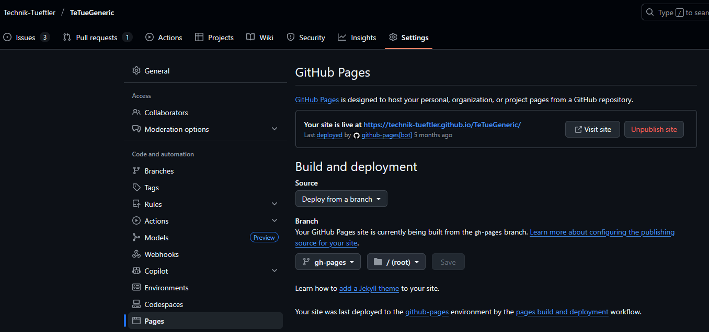

Workflow
========
This chapter lists all workflows that are executed automatically. However, 
these are only valid for GitHub at this time.

.. hint::
    The workflows ``Merge Test``, ``Pylint`` and ``Pytest`` are always executed in 
    Pull-Requests and are immediately active without any adjustments. 

Merge Test
----------
This Workflow is triggered when a pull request is created or updated. It checks if
the development mode is active or if the version already exists as a release. If one
of these conditions is true, the merge is blocked. This is to ensure that no 
development implementations are enabled and that the version has been incremented for a new PR.

Pylint
------
This Workflow is triggered when a pull request is created or updated. It checks the
code using Pylint and reports any issues found.

Pytest
------
This Workflow is triggered when a pull request is created or updated. It runs the
unit tests using Pytest and reports any failures.

Documentation
-------------
This Workflow is triggered when a pull request is closed and create automatically 
the documentation for the project using Sphinx and deploy it to GitHub Pages. However, 
the necessary settings must first be created in GitHub:

.. attention::
    The documentation is generated using the ``docs/`` folder as the source.
    Therefore, all files must be located in this folder and the ``conf.py`` file
    must also be adapted accordingly. Also this workflow is only working 
    correctly if all settings in ``Repository > Settings > Pages`` are set as shown in the image above.